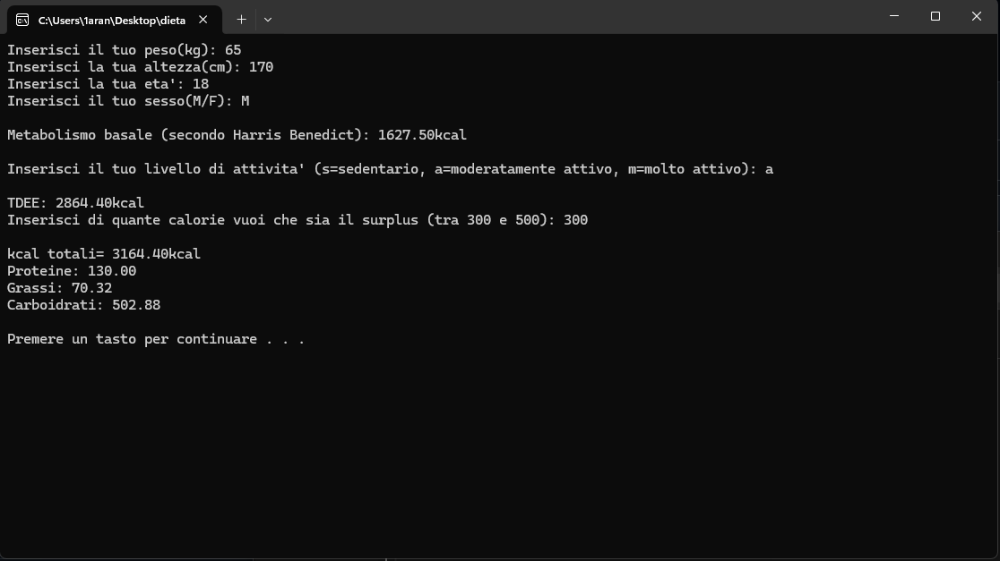

# DietaMassa
Calcolatore di BMI (metabolismo basale), TDEE (fabbisogno giornaliero) e macronutrienti (carboidrati, proteine e grassi) mediante l'applicazione della formula di Harris-Benedict

##Screenshot

